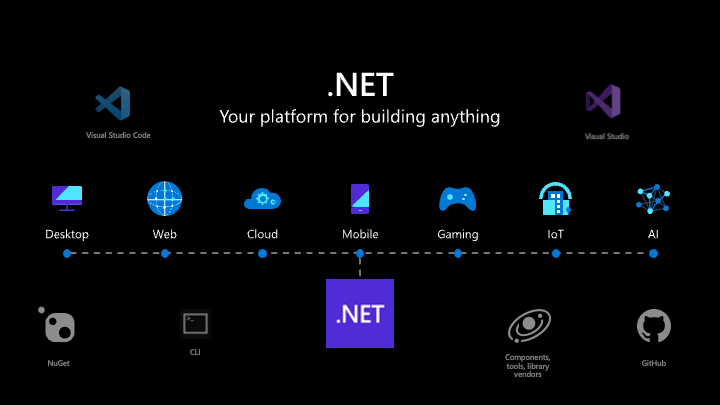

  
  

### 
hey! I 'm Ahmed Hussain aka "huzcodes" 👋
  
  

- 🚀Principal Software Engineer transforming ideas into elegant solutions. Passionate about coding, creating, and continuous learning. Contributor to open source projects, exploring new technologies, and problem solving enthusiast. Let's build something amazing together! 💻✨

 

- ❤️ I 'm in love with architecture and design patterns, the most loved one is DDD 😍
  

- ❓ Ask me about anything related to .NET Core and related technologies  
  

- ⛈️ Thor forever,😆Great by nature, ❤️Addicted to Microsoft ecosystem!   
  

   

## My Skill Set  
<table><tr><td valign="top" width="33%">

### Frontend  

  
  
  
  
  
  
  
  
  
  
  
  
  

</td><td valign="top" width="33%">

### Backend  

  
  
  
  
  
  
  
  
  
  
  
  
  

</td><td valign="top" width="33%">

### DevOps  

  
  
  
  
  
  
  
  
  
  

</td></tr></table>  

   

## Connect with me  

  

  
  

   

## Github Most Used Languages  

  

   

   

  

   

  

   

 

----

Generated using <a href="https://profilinator.rishav.dev/" target="_blank">Github Profilinator</a>

